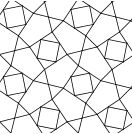

# Droste

## Contents
* [Introduction](#introduction)
* [Fish](#fish)
* [Wobble](#wobble)
* [Zeccatello](#zeccatello)

## Introduction
On this page, several grounds made with the "Droste-effect". Some of these, like "Wobble" can not be made as a GroundForge first level ground. See page [_Droste-effect_][pg-droste] on the Groundforge help-pages for more information.  
Some of the examples show a forms to make playing easier. 

[pg-droste]: https://d-bl.github.io/GroundForge/help/Droste-effect

### Generate diagrams 
After clicking the link or the go-button on the form, the GroundForge main page appears.
Click the  in the advanced section for the thread diagram.
(more explanation?)

## Fish     
_Double fish B2,S2,W3_ also can be made using Droste [second level][F2-223] which uses the thread diagram of the first level as pair diagram for the second level. Please replace cross b102 in the level-2 thread diagram with a half knot or two to mimic a twisted pair.       
The first level can be split in two levels, with the same result at the [third level][F3-223]. Defining a footside however will become problematic, as we have four workers going into the same direction before returning. In practice you can bend this rule and change direction every other row, provided that plain twists separate the fish. Note that in both cases it can take a while for the last levels to appear.    
Please note the resemblance of the level-3 fish with the [narrow eyed spider][ne-spiders-page]. See page [_fish_][fish-page] for the fish names.

[ne-spiders-page]: https://maetempels.github.io/MAE-gf/docs/spiders#spiders-with-a-narrow-eye
[fish-page]: https://maetempels.github.io/MAE-gf/docs/fish

[F2-223]: https://d-bl.github.io/GroundForge/tiles.html?patchWidth=6&patchHeight=14&b1=ctct&a2=ctct&b3=ct&a4=ctct&b5=ctc&b6=ctcl&a6=ctc&b7=ctc&a7=ctcr&droste2=ctc,b30=tct,b44=a45=b15=b14=tt,b64=a74=ttctctt&tile=-4,5-,-5,5-,-5,21,88&footsideStitch=ctctt&tileStitch=ctct&headsideStitch=ctctt&shiftColsSW=0&shiftRowsSW=7&shiftColsSE=2&shiftRowsSE=7

[F3-223]: https://d-bl.github.io/GroundForge/tiles.html?patchWidth=6&patchHeight=6&a1=ctc&a2=cr&a3=c&a4=lc&droste2=ctc,a10=a11=ctcrr,a20=a21=a40=ctct,a30=ct,,,,&droste3=ctc,a300=tct,a104=a114=ttctctt,a204=a205=a404=a405=tt,&tile=8,1,8,1,&footsideStitch=ctctt&tileStitch=ctct&headsideStitch=ctctt&shiftColsSW=0&shiftRowsSW=4&shiftColsSE=1&shiftRowsSE=4

## Wobble

This family of grounds was discovered by J. Pol. 
The name was inspired by the left pricking.

### Pricking

The left pricking is generated with one of the "ground from template" 
[tools](https://d-bl.github.io/inkscape-bobbinlace/Ground-from-Template)
and a plain text file (<a href="../data/wobble.txt" download>download</a>).

On the right a distorted version that matches a Torchon grid. 
The units of the rose-ground are placed in different directions, indicated with blue arrows.
These units can be replaced with units of a bias ground.
The green numbers and arrows indicate the working order inherited frm the first pair diagram.

### Generate diagrams (color coded and threads)

After completing the stitches in the form below,
press go for the desired type of units.
In the page that will appear next, click the 
in the advanced section for the thread diagram.
(more explanation?)




## Zeccatello
The Whiting sampler has a "Fancy Zeccatello" ground:
[F12](https://d-bl.github.io/GroundForge/tiles?whiting=F12_P190&patchWidth=16&patchHeight=16&f1=ctc&d1=tctct&b1=ctc&g2=ctctctc&e2=tctct&c2=tctct&a2=ctctctc&f3=ctc&d3=tctct&b3=ctc&g4=ctcrrctc&f4=ctc&e4=ctcllctc&c4=ctcrrctc&b4=ctc&a4=ctcllctc&tile=-4-5-7--,b-5-5-c-,-5-5-5--,a15-58d-&footsideStitch=ctctt&tileStitch=ctc&headsideStitch=ctctt&shiftColsSW=-4&shiftRowsSW=4&shiftColsSE=4&shiftRowsSE=4).
M. Tempels discovered it can also be made as a level 2 
[ground](https://d-bl.github.io/GroundForge/tiles?patchWidth=12&patchHeight=16&c1=clcrct&a1=crclct&d2=ctct&droste2=ctct,c11=a13=ctcllctc,a11=c13=ctcrrctc,d25=c10=c12=c14=ctc,d24=a10=a12=a14,a16=c15=ctctctc&tile=B-C-,---5&footsideStitch=ctctt&tileStitch=ctc&headsideStitch=ctctt&shiftColsSW=-2&shiftRowsSW=2&shiftColsSE=2&shiftRowsSE=2), 
starting with the Paris ground.

***
